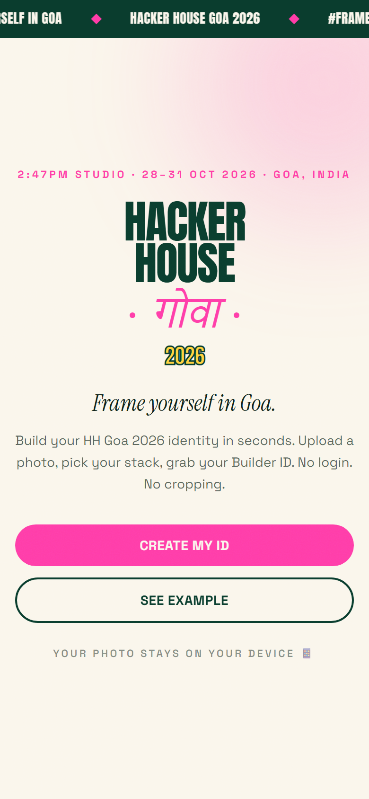
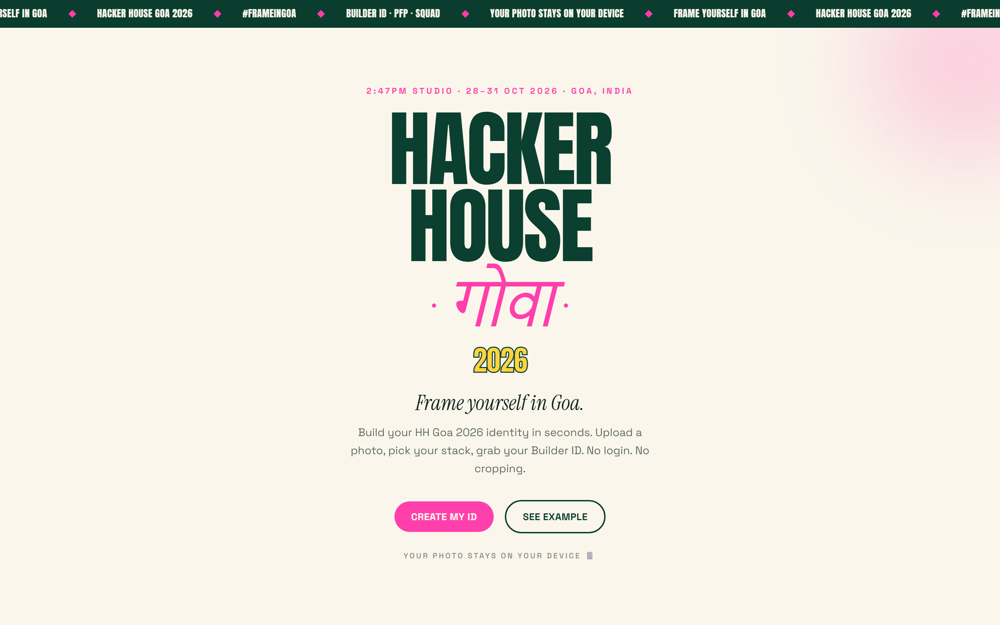
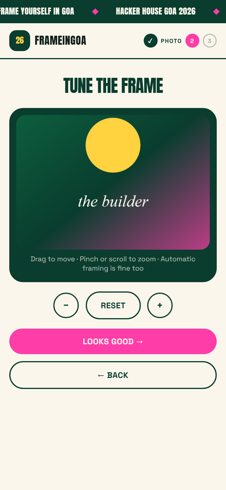
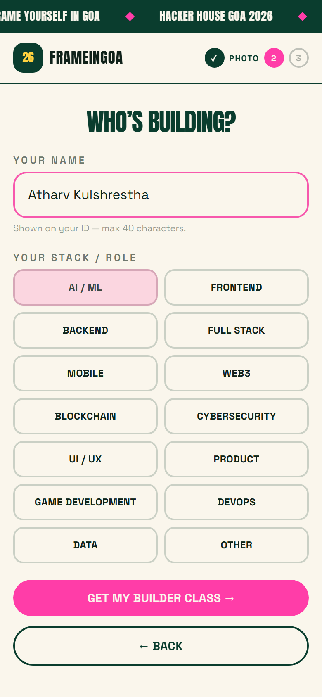
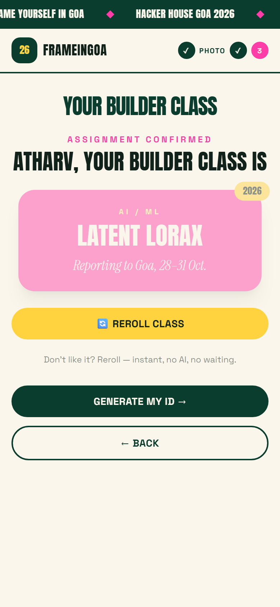
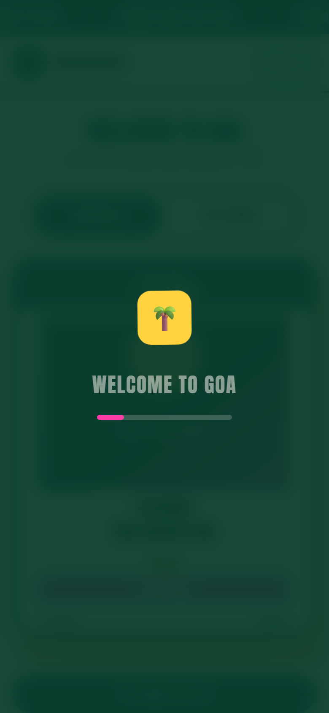
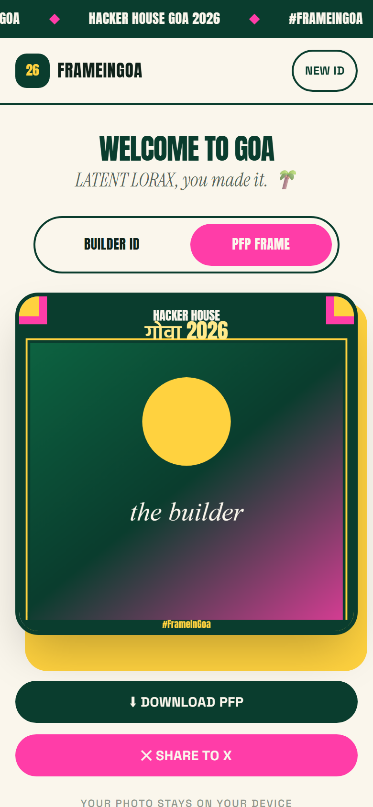

# FrameInGoa — Hacker House Goa 2026 Builder ID Generator

A mobile-first web app that turns any photo into an unmistakably Hacker House Goa–branded **Builder ID** and **PFP frame**. Upload, pick your name + stack, and generate an instant frame with a uniquely rolled **Builder Class**. Download it as a real PNG or share it straight to X with `#FrameInGoa`.

Live: **https://frameingoahhgoa.vercel.app**

---

## The Task

This is an Open Trial Task for **Hacker House Goa 2026**:

> Build an interactive web app — a photo frame / ID generator. Users upload a photo, enter a name and their stack, and get an instant, branded Builder ID.

Hard requirements this app meets:

- **Unmistakably Hacker House Goa** — a deep-green + sun-yellow + punch-pink identity, oversized editorial typography, Devanagari गोवा accents, and the Hacker House wordmark. Not a generic badge.
- **Works on any photo — no manual cropping** — portrait, landscape, off-center, any aspect ratio. The frame auto-covers the photo; a drag/zoom fallback is available if you want to re-position.
- **A few seconds, not a loading screen** — pure client-side canvas rendering. No server round-trip for image processing.
- **Real image file** — downloads a true PNG (1350×1688 ID / 1080×1080 PFP) with the correct `HHGoa26_<name>-id.png` filename.
- **Working share flow** — a share button that actually pushes the image to X (Web Share API with the PNG attached, falling back to an X intent with the pre-built caption), not a button that only opens X.

---

## Features

### P0 — Core
- Photo upload (click, drag-and-drop, or camera) — JPG, PNG, and **HEIC**
- Auto photo handling: HEIC→JPEG conversion, EXIF orientation correction, smart downscale — **no manual cropping required**
- Name + stack selection (14 stacks, plus a custom "Other" option)
- **Builder Class**: a flavourful per-stack class rolled from a seeded PRNG (e.g. *Model Whisperer*, *Latent Lorax*), with a **reroll** button
- Instant **Builder ID** render on canvas — photo, name, stack, class, and full HH Goa branding
- **PNG download** with correct naming
- **Share to X** with a generated caption + `#FrameInGoa`

### P1 — Polish
- **PFP frame** mode (1080×1080) — corner ticks + wordmark variant
- Drag / pinch / scroll-zoom **re-position fallback** (with reset)
- class reroll, animated transitions (anime.js)
- Progress overlay: *READING PHOTO → FRAMING BUILDER → WELCOME TO GOA*

### P2 — Squad Mode
- Add up to 2 teammates and generate a combined **Squad** graphic (1080×1080), downloadable and shareable

### Everywhere
- **Your photo never leaves your device** — all processing happens in the browser
- Truly mobile-first: no horizontal scroll from 320px up, 44px+ tap targets, 16px+ body text, safe-area insets, `prefers-reduced-motion` respected
- SEO/OG/Twitter meta + generated social image

---

## How it works

1. **Landing** — hero, how-it-works, Builder Classes preview, CTA.
2. **Upload** — drop or pick a photo. It is validated, de-rotated (EXIF), HEIC-converted if needed, and downscaled in the browser.
3. **Reposition** *(fallback)* — drag/pinch to re-frame, or accept the auto position.
4. **Details** — enter your name and pick your stack.
5. **Builder Class** — a unique class is rolled for your stack; reroll if you don't like it.
6. **Generate** — the ID (or PFP) renders instantly on a canvas. Download the PNG or share to X.
7. **Squad** *(optional)* — add teammates, generate the squad graphic, download/share.

---

## Architecture

```
HHG/
├── index.html                      # SEO/OG/Twitter meta, Google Fonts
├── vite.config.ts                  # react + @tailwindcss/vite plugins
├── public/
│   ├── favicon.svg
│   └── og-image.png                # 1200×630 social image
├── src/
│   ├── index.css                   # Tailwind v4 tokens + component classes
│   ├── App.tsx                     # Orchestrator: landing → wizard → output + squad
│   ├── types.ts                    # shared types + OUTPUT_SIZES
│   ├── data/stacks.ts              # 14 stacks + Builder Classes + seeded roll/reroll
│   ├── lib/
│   │   ├── image.ts                # HEIC/EXIF/downscale, cover math, viewport drawing
│   │   ├── renderer.ts             # renderId / renderPfp / renderSquad on canvas
│   │   └── share.ts                # caption, X intent, download, Web Share
│   ├── hooks/useReveal.tsx         # anime.js scroll reveal
│   └── components/                 # Landing, Marquee, Footer, UploadZone,
│                                   # ProgressOverlay, RepositionStep, InfoStep,
│                                   # ClassStep, OutputStep, SquadPanel
└── tests/
    ├── run.mjs        # build → preview → smoke → layout verification
    ├── smoke.mjs      # 24 end-to-end checks (puppeteer-core + system Edge)
    ├── analyze.mjs    # 18 pixel-level layout checks
    ├── make-og.mjs    # regenerates public/og-image.png
    └── make-shots.mjs # regenerates docs/screenshots/*
```

The frame itself is drawn with the HTML Canvas API (`src/lib/renderer.ts`) at fixed output sizes:

| Output   | Dimensions |
|----------|-----------|
| Builder ID | 1350 × 1688 |
| PFP frame  | 1080 × 1080 |
| Squad      | 1080 × 1080 |

Fonts are loaded via Google Fonts and re-rendered once loaded (with a timeout guard), so the canvas is never blank.

---

## Local setup

```bash
npm install
npm run dev        # dev server on :5173
npm run build      # tsc + production build to dist/
npm run preview    # serve the production build
npm test           # build + smoke (24) + layout verification (18)
npm run lint       # oxlint
```

`npm test` uses the Edge browser on Windows via `puppeteer-core`. To point it at another Chrome/Chromium/Edge binary, edit `EDGE` in `tests/smoke.mjs` / `tests/analyze.mjs` / `tests/make-shots.mjs`, or set `BASE_URL` to test against a running server.

---

## Technology

- **React 19 + TypeScript** — app shell and wizard flow
- **Vite 8** — fast builds, code splitting
- **Tailwind CSS v4** — design tokens + utility styling
- **HTML Canvas API** — image compositing and framing
- **heic2any** — HEIC→JPEG, lazy-loaded (1.35MB chunk only fetched when a HEIC is uploaded; main bundle is ~85KB gzipped)
- **anime.js v4** — animations
- **puppeteer-core** — end-to-end + pixel-level test harness

## Privacy

100% client-side. Your photo is processed and framed **on your device**. Nothing is uploaded, stored, or sent to any server. HEIC conversion happens locally via WebAssembly.

## Known limitations

- HEIC chunk (~1.35MB) downloads on first HEIC upload.
- X sharing falls back to an intent tab (with the caption pre-filled) on browsers without the Web Share API / file share support — the desktop share button may open a new tab.
- Very large photos are downscaled to a max of 2200px on the longest edge for performance.

---

## Screenshots

Mobile flow | Desktop landing
:-----------:|:-------------:
 | 

    

---

Built with the open trial task spirit: fast, fun, and entirely on-device.
